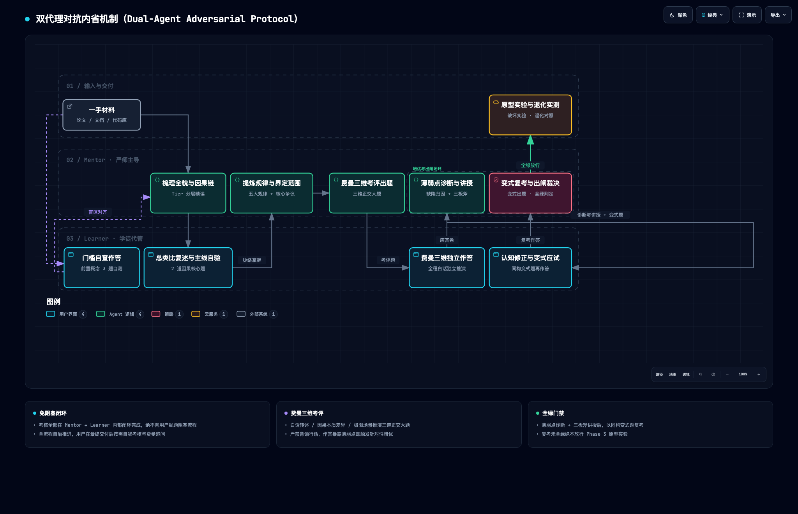
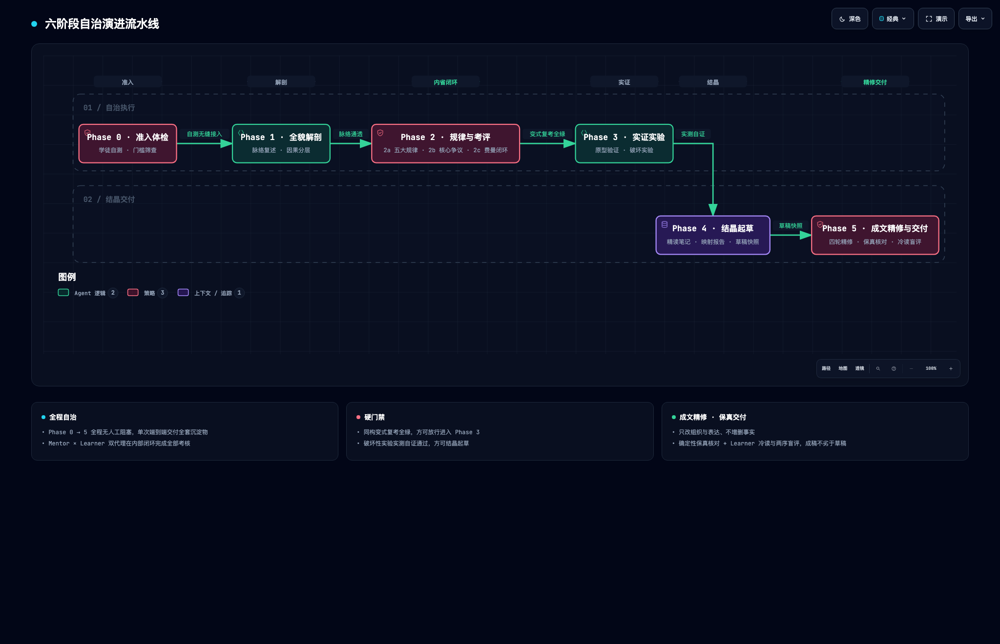

# Guided Learn — 导师式精读与领域掌控

以**严师 Mentor + 学徒 Learner Subagent 双代理对抗内省**，带用户系统化精读并掌控论文、长文档、网页、视频、代码库等一手材料：
全貌解剖（先梳理后总结）→ 领域底层规律与争议提炼 → 双 Agent 费曼考评闭环（白话推演/诊断/培优/变式复考）→ 最小原型实践与破坏性实验 → 经验结晶起草 → 成文精修与交付。

**核心创新**：学习全流程所有确认、答复、考核评估与通过性测试默认由内置定制的 **Learner Subagent** 代管协助完成，消除中途交互阻塞；整套高价值知识与工程资产端到端自治交付，用户在获取完整沉淀后可按需发起追问与费曼自我考核。

**核心哲学**：**熵减（Entropy Reduction）**——以因果链路对抗信息碎片化，以子 Agent 内省对抗形式主义，以确定性实验对抗纸面空谈，以正交映射对抗重复造轮子，以成文精修对抗拼装碎片。

---

## 安装

本技能遵循 [Agent Skills 开放标准](https://agentskills.io/specification)（frontmatter 仅用标准字段，可通过 `skills-ref validate` 校验），各宿主通用，差异仅在技能目录：

| 宿主 | 全局技能目录 | 工作区级技能目录 |
| :--- | :--- | :--- |
| Claude Code | `~/.claude/skills/` | `<repo>/.claude/skills/` |
| Antigravity IDE | `~/.gemini/config/skills/` | `<workspace>/.agents/skills/` |
| 其他遵循跨客户端约定的宿主 | `~/.agents/skills/` | `<repo>/.agents/skills/` |

> 第三行为 [agentskills.io 客户端实现指南](https://agentskills.io/client-implementation/adding-skills-support)推荐的跨客户端约定目录，是否扫描以各宿主文档为准（Claude Code 不扫描该目录）。

```bash
# 方式一：克隆即装（外部用户）——SKILL_DIR 取上表对应目录
SKILL_DIR=~/.claude/skills   # Antigravity IDE 改为 ~/.gemini/config/skills
git clone https://github.com/ThreeFish-AI/guided-learn.git $SKILL_DIR/guided-learn

# 方式二：symlink（本机维护模式——改仓库即改 Skill，多宿主共享单一事实源）
git clone https://github.com/ThreeFish-AI/guided-learn.git ~/{projects-dir}/guided-learn
ln -s ~/{projects-dir}/guided-learn ~/.claude/skills/guided-learn           # Claude Code
ln -s ~/{projects-dir}/guided-learn ~/.gemini/config/skills/guided-learn    # Antigravity IDE
```

> 技能清单在**会话开始时**扫描，安装后须重启 Agent 会话方可被发现。Antigravity 向后兼容旧路径 `~/.gemini/antigravity/skills/` 与 `.agent/skills/`。

---

## 使用

显式调用：`/guided-learn <材料 URL 或路径>`（Claude Code 与 Antigravity IDE 通用）；或自然语言触发——
「带我精读这篇论文」「先梳理全貌不要急着总结」「提炼这个领域的核心规律与争议」「以老师身份教我掌握 X」「帮我搞懂这份资料/视频并实践」。
只要提供一手材料并希望深入掌握、接受考核或动手验证即会触发；快速摘要 / TL;DR、全文翻译、Bug 排查等不触发，完整排除清单以 [SKILL.md](SKILL.md) frontmatter `description` 为准（评测集见 [evals/trigger-evals.json](evals/trigger-evals.json)）。
考核默认由 Learner Subagent 代管；想本人在流程中受考，直接说明即可（如「每节结束抽查我」），对应门禁改由你作答、标准不放松。

**RSI 自我改进**：使用中由你或 Agent 发现的本 Skill 错误与改进项会被旁路记录、不打断学习；交付后由独立子 Agent 调研、改进与核验，门禁全绿后再按批向你确认一次（对外发布授权，不属学习门禁），方以 PR 回馈本仓库。需 `gh` 已登录，否则降级为本地 patch；持久授权与关闭方式见 [references/rsi-hook.md](references/rsi-hook.md#7-确认与提交)。

---

## 工作流（六阶段自治演进流水线）

<picture>
  <source media="(prefers-color-scheme: light)" srcset="assets/architecture/dual-agent-adversarial-protocol-light.png">
  
</picture>

*图 1 · 双代理对抗内省机制（Dual-Agent Adversarial Protocol）。图源 [Mermaid 源](assets/mermaid/dual-agent-adversarial-protocol.mmd) · [交互版 HTML](assets/architecture/dual-agent-adversarial-protocol.html)*

<picture>
  <source media="(prefers-color-scheme: light)" srcset="assets/architecture/six-phase-autonomous-pipeline-light.png">
  
</picture>

*图 2 · 六阶段自治演进流水线（Six-Phase Autonomous Pipeline）。图源 [Mermaid 源](assets/mermaid/six-phase-autonomous-pipeline.mmd) · [交互版 HTML](assets/architecture/six-phase-autonomous-pipeline.html)*

| 阶段 | 核心内容 | 协同执行机制 | 门禁验收（内部自治） | 用户交互状态 |
| :--- | :--- | :--- | :--- | :--- |
| **Phase 0** | 准入体检：摄取一手材料（含附录），提取前置门槛与补课建议 | Mentor 提取门槛自测题 ↔ Learner Subagent 独立自检作答 | 明确知识盲区与补课建议 | 免阻塞（自治演进） |
| **Phase 1** | 全貌解剖：一句话本质与贯穿总类比（30–50 跨域候选脑暴-重聚择一 + 类比计划）+ 最重要的几个部分（分层矩阵）+ 因果脉络链 + 基础层 vs 学习焦点排序与批判边界 | Mentor 讲授解剖 ↔ Learner Subagent 脉络复述与主线验证 | 总类比遴选定锚、类比计划完备；理清因果主线与 5 条批判边界 | 免阻塞（自治演进） |
| **Phase 2** | 底层规律、核心争议与双 Agent 费曼考评：<br/>• **2a. 规律篇**：正交分解 5 大底层规律（最简解释 + IEEE 锚点 + 实证演示）<br/>• **2b. 争议篇**：统一世界观剖析 2~3 个核心技术争议<br/>• **2c. 费曼考评篇**：资料研究范围界定 + 费曼三维考评 + 薄弱点诊断 + 针对性充分教授 + 同构变式复考 | Mentor 出题与审校 ↔ Learner Subagent 独立应答、暴露薄弱点、吸收教授并完成变式复考 | 完成研究范围界定；费曼三维考评通过同构变式复考全绿闭环 | 免阻塞（自治演进） |
| **Phase 3** | 原型验证与破坏性实验：在 `.temp/` 构建轻量确定性 mock 原型，实机逐一拔掉 3~5 个机制记录真实退化 | 实验脚本执行与断言自验 | `selftest` 全绿 + 破坏性退化实测记录 | 免阻塞（自治演进） |
| **Phase 4** | 经验结晶起草：三拍结构精读笔记（archify 优先）+ 代码行号精准映射报告，按模板起草落盘并快照为保真基线 | 结晶落盘与系统代码核验 | 两份草稿落盘 `docs/`；草稿快照入 lab 并登记 sha256 | 免阻塞（自治演进） |
| **Phase 5** | 成文精修与交付：诊断 AI 味与拼装碎片 → 结构 / 段落 / 句词 / 版式四轮精修 → 确定性保真核对 → 冷读与两序盲评，把拼装稿改成读来如人写的成稿（总分总 / 结论先行），再归档提交、一次交付 | Mentor 精修与保真核对 ↔ Learner Subagent 冷读复述与盲评 | 保真核对全绿（事实零丢失零新增）；冷读卡点清零或记为已知局限；盲评逐章出闸；知识索引登记（项目有约定时）；原子化提交（非 git 项目除外） | **端到端完整交付** |
| **Post-Mastery** | 用户费曼研讨与自我考核套件：提供 3 道高阶费曼思考题与追问入口 | 用户按需自由选择 ↔ Mentor 严师级答疑与费曼点评 | 用户按需选答或追问，Mentor 提供即时深度反馈 | **按需用户互动** |
| **RSI（横切）** | 自我改进钩子：旁路捕获本 Skill 的错误与改进项，交付后调研、最小改进并核验，以 PR 回馈上游 | Steward Subagent 改进 ↔ Verifier Subagent 独立核验 | 五道门禁全过方可提 PR，否则仅报告 | **交付后一次性确认** |

---

## 仓库结构

```
SKILL.md                      # 核心契约：frontmatter 触发描述、教学铁律、双代理协议、易错点、验收总表与六阶段流水线（Agent 激活时加载）
references/lecture-format.md  # 讲授/考评模板（全貌三问/总类比遴选协议/规律/争议/费曼考评实录/用户自测套件/笔记与映射报告骨架）
references/prototype-lab.md   # 最小原型实验室方法论（确定性 mock / 场景设计 / 破坏性实验纪律）
references/diagram-assets.md  # 图表资产管线规范（archify 优先 / Mermaid 降级）
references/final-polish.md    # 成文精修规约（五层诊断清单 / 四轮精修 / 确定性保真核对 / 冷读盲评 / 过度精修反模式）
references/rsi-hook.md        # RSI 自我改进钩子协议（触发白名单 / 旁路捕获 / 核验门禁 / PR 模板 / 降级矩阵）
evals/trigger-evals.json      # 触发评测集（10 应触发 + 10 近邻不触发，供 description 优化）
evals/heldout-trigger-evals.json # held-out 触发评测集（10 + 10 边界探针；已参与一次 description 排除清单调参，此后视为 in-sample，泛化验证须另建新集）
evals/evals.json              # 任务评测集（论文全流程 / 轻量材料裁剪 / TL;DR 边界 / 用户本人受考）
assets/README.md              # 图表资产登记索引（spec / artifact 双 SHA-256）
assets/mermaid/               # 图表文本源 SSOT（Mermaid .mmd，头部含溯源注释）
assets/architecture/          # archify 交付产物（交互 HTML / 双主题 PNG / spec 与校验记录）
LICENSE                       # MIT
```

---

<div align="center">
  <sub>Built with 🧠, ❤️, and an absurd amount of coffee by <a href="https://github.com/ThreeFish-AI">ThreeFish-AI</a> · Released under the <a href="./LICENSE">MIT</a>.</sub>
</div>
