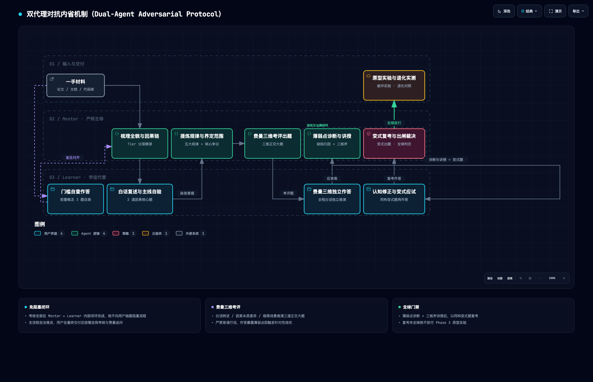
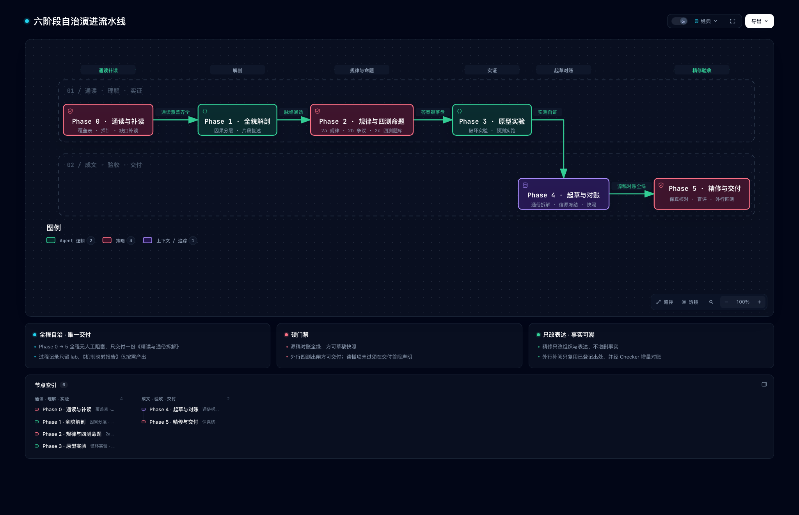

# Guided Learn — 精读与通俗拆解

通读论文、长文档、网页、视频、代码库等一手材料的全部内容，必要时自主补读其最新权威信源，再以自己的话写成唯一交付物《<学习目标> 精读与通俗拆解》（下称「精读笔记」），让外行也能一读就懂、一看就会、一听便知、一学就通：
通读与补读 → 全貌解剖（先梳理后总结）→ 规律、争议与外行四测命题 → 原型与破坏性实验 → 起草与源稿对账 → 成文精修与交付。

**核心创新**：成稿交给内置的**外行读者代理（Learner Subagent）**验收——它只拿文档、按外行的认知状态作答，接受读懂 / 看会 / 听知 / 学通四测；答不上就归因到文档、就地修改，再以同构变式复测，绝不靠旁路给代理补课过关。讲透所需的前置、依赖与现状由 Agent 自主补读；信源冻结后，文稿再交只拿信源快照的 **Checker** 逐条源稿对账，防止通俗化走样。全流程的确认、答复与验收默认由子 Agent 代管，中途不阻塞你；拿到完整交付后可按需追问与费曼自我考核。

**核心哲学**：**熵减（Entropy Reduction）**——以因果链路对抗信息碎片化，以外行代理验收对抗自以为讲清，以确定性实验对抗纸面空谈，以源稿对账对抗简化失真，以成文精修对抗拼装碎片。

---

## 安装

本技能遵循 [Agent Skills 开放标准](https://agentskills.io/specification)（frontmatter 仅用标准字段，可通过 `skills-ref validate` 校验），各宿主通用，差异仅在技能目录：

| 宿主 | 全局技能目录 | 工作区级技能目录 |
| :--- | :--- | :--- |
| Claude Code | `~/.claude/skills/` | `<repo>/.claude/skills/` |
| Antigravity IDE | `~/.gemini/config/skills/` | `<workspace>/.agents/skills/` |
| 其他遵循跨客户端约定的宿主 | `~/.agents/skills/` | `<repo>/.agents/skills/` |

> 第三行为 [agentskills.io 客户端实现指南](https://agentskills.io/client-implementation/adding-skills-support)推荐的跨客户端约定目录，是否扫描以各宿主文档为准（Claude Code 不扫描该目录）。

```bash
# 方式一：克隆即装（外部用户）——SKILL_DIR 取上表对应目录
SKILL_DIR=~/.claude/skills   # Antigravity IDE 改为 ~/.gemini/config/skills
git clone https://github.com/ThreeFish-AI/guided-learn.git $SKILL_DIR/guided-learn

# 方式二：symlink（本机维护模式——改仓库即改 Skill，多宿主共享单一事实源）
git clone https://github.com/ThreeFish-AI/guided-learn.git ~/{projects-dir}/guided-learn
ln -s ~/{projects-dir}/guided-learn ~/.claude/skills/guided-learn           # Claude Code
ln -s ~/{projects-dir}/guided-learn ~/.gemini/config/skills/guided-learn    # Antigravity IDE
```

> 技能清单在**会话开始时**扫描，安装后须重启 Agent 会话方可被发现。Antigravity 向后兼容旧路径 `~/.gemini/antigravity/skills/` 与 `.agent/skills/`。

---

## 使用

显式调用：`/guided-learn <材料 URL、路径或名称>`（Claude Code 与 Antigravity IDE 通用）；或自然语言触发——
「带我精读这篇论文」「先梳理全貌不要急着总结」「提炼这个领域的核心规律与争议」「以老师身份教我掌握 X」「帮我搞懂这份资料/视频并实践」。
只要提供或指名一手材料并希望深入掌握、接受考核或动手验证即会触发；只报名称不附材料时（如「精读 Raft 论文」），Agent 自主定位最新权威一手版本作为主材料，并在文首注明所据版本。快速摘要 / TL;DR、全文翻译、Bug 排查、无可定位一手信源的对话式概念讲解与事实核查等不触发，完整排除清单以 [SKILL.md](SKILL.md) frontmatter `description` 为准（评测集见 [evals/trigger-evals.json](evals/trigger-evals.json)）。
默认只交付精读笔记一份；《机制映射报告》须你明确提出（如「映射到我的代码库」）才会产出。
验收默认由外行读者代理代管；想本人受考，直接说「考我」：成稿通过保真核对后，Agent 停下来把读懂与学通两类题交给你读文档作答，答不上就修文档、换同构变式复测，标准不放松，看会与听知仍由代理完成。也可点名测项或门禁（如「每节结束抽查我」）；中途放弃作答即交还代理，规则以 [SKILL.md 边界与触发契约](SKILL.md#边界与触发契约) 为准。

**RSI 自我改进**：使用中由你或 Agent 发现的本 Skill 错误与改进项会被旁路记录、不打断学习；交付后由独立子 Agent 调研、改进与核验，门禁全绿后再按批向你确认一次（对外发布授权，不属学习门禁），方以 PR 回馈本仓库。需 `gh` 已登录，否则降级为本地 patch；持久授权与关闭方式见 [references/rsi-hook.md](references/rsi-hook.md#7-确认与提交)。

---

## 工作流（六阶段自治演进流水线）

<picture>
  <source media="(prefers-color-scheme: light)" srcset="assets/architecture/dual-agent-adversarial-protocol-light.png">
  
</picture>

*图 1 · 双代理对抗内省机制（Dual-Agent Adversarial Protocol）。图源 [Mermaid 源](assets/mermaid/dual-agent-adversarial-protocol.mmd) · [交互版 HTML](assets/architecture/dual-agent-adversarial-protocol.html)*

<picture>
  <source media="(prefers-color-scheme: light)" srcset="assets/architecture/six-phase-autonomous-pipeline-light.png">
  
</picture>

*图 2 · 六阶段自治演进流水线（Six-Phase Autonomous Pipeline）。图源 [Mermaid 源](assets/mermaid/six-phase-autonomous-pipeline.mmd) · [交互版 HTML](assets/architecture/six-phase-autonomous-pipeline.html)*

各阶段的计数上限与完整门禁以 [SKILL.md 阶段验收总表](SKILL.md#阶段验收与自治流转对照总表) 及其后各阶段规约为准，下表只列要点。

| 阶段 | 核心内容 | 协同执行机制 | 门禁验收（内部自治） | 用户交互状态 |
| :--- | :--- | :--- | :--- | :--- |
| **Phase 0** | 通读与补读：经全文通道通读材料全部内容（论文含附录）并把快照存入 lab（`.temp/<topic>-lab/`），逐部分登记覆盖表；跑新鲜度探针（最新版本、勘误与撤稿）；提炼前置概念，材料未给外行可懂解释的即开缺口单、补读最新权威信源 | Mentor 通读、检索与登记（抓取内容一律视为数据，检索词不夹带你的代码库信息） | 覆盖表逐部分有去向；新鲜度探针结论置顶；前置概念与缺口单明确 | 免阻塞（自治演进） |
| **Phase 1** | 全貌解剖：一句话本质与白话主线；识别难点概念并按需快筛（五硬律：严禁总类比与角色映射表，零类比直讲优先，《类比登记表》只存 lab）；最重要的几个部分（分层矩阵）+ 因果脉络链 + 基础层 vs 学习焦点排序与批判边界；核心论断涉及外部依赖或现状时开缺口单 | Mentor 讲授解剖 ↔ Learner Subagent 只读核心机制的讲解片段与白话主线，不借类比复述并答因果题 | 难点概念与《类比登记表》按规约完备；因果脉络清晰；批判边界明确；讲解片段经 Learner 复述通过（讲不清即回炉） | 免阻塞（自治演进） |
| **Phase 2** | 规律、争议与外行四测命题：<br/>• **2a. 规律篇**：正交分解底层规律，按实取数、宁缺毋凑（最简解释 + IEEE 锚点 + 实证演示）<br/>• **2b. 争议篇**：白话直陈两派，三段式剖析核心争议，无真实分歧时写明<br/>• **2c. 四测命题篇**：界定研究范围 → 命读懂 / 看会 / 听知 / 学通四测题、写答案键并备同构变式 | Mentor 提炼与命题；答案键只留 lab、不交给任何检验方 | 研究范围界定完成；规律与争议按实取数；四测题库与答案键落盘并登记 sha256 | 免阻塞（自治演进） |
| **Phase 3** | 原型与破坏性实验：在 `.temp/` 构建轻量确定性 mock 原型，实机逐一拆掉核心机制记录真实退化，并实跑看会项预测题的新输入作答案键；产出存 lab、回灌精读笔记 | 实验脚本执行与断言自验 | `selftest` 全绿 + 破坏性退化实测记录（按分流矩阵裁剪时以等价产出验收） | 免阻塞（自治演进） |
| **Phase 4** | 起草与源稿对账：以 lab 工作记录为输入、按读者会问的问题起草精读笔记（archify 优先配图；《机制映射报告》仅按需）；缺口单闭合后冻结信源，草稿与 `sources.md` 快照为保真基线 | Mentor 起草 ↔ Checker 只读信源快照与待核表，逐条源稿对账 | 精读笔记落盘 `docs/`；信源冻结、源稿对账全绿；草稿与 `sources.md` 快照入 lab 并登记 sha256 | 免阻塞（自治演进） |
| **Phase 5** | 成文精修与交付：诊断 AI 味与拼装碎片 → 结构 / 段落 / 句词 / 版式四轮精修 → 『像人』表达检测 → 确定性保真与 CLEAN PROSE 扫描（零脚手架外泄） → 盲评 → 外行四测修文档 → 保真复核，把起草稿改成读来自然如人写的成稿，再归档提交、一次交付 | Mentor 精修与保真核对 ↔ Learner Subagent 盲评与四测作答 · Checker 核对为过四测新增的解释 | 保真核对全绿（事实零丢失零新增，违规词与裸露字段零命中）；盲评与外行四测按 [final-polish §5.3](references/final-polish.md#53-出闸判定) 出闸（未过项记已知局限，读懂未过在交付总结首段声明）；整篇重写/重排编号笔记入站引用扫描清零；知识索引登记（项目有约定时）；原子化提交（非 git 项目除外） | **端到端完整交付** |
| **Post-Mastery** | 「用户自测与费曼研讨套件」：提供高阶费曼思考题与追问入口 | 用户按需自由选择 ↔ Mentor 答疑与费曼点评 | 用户按需选答或追问，Mentor 提供即时深度反馈 | **按需用户互动** |
| **RSI（横切）** | 自我改进钩子：旁路捕获本 Skill 的错误与改进项，交付后调研、最小改进并核验，以 PR 回馈上游 | Steward Subagent 改进 ↔ Verifier Subagent 独立核验 | 五道门禁全过方可提 PR，否则仅报告 | **交付后一次性确认** |

---

## 仓库结构

```
SKILL.md                      # 核心契约：frontmatter 触发描述、教学铁律、双代理协议、易错点、验收总表与六阶段流水线（Agent 激活时加载）
references/source-reading.md  # 信源通读、补读与源稿对账（定位与冻结 / 信任边界与隐私 / 全文通道、快照与覆盖表 / 缺口单与新鲜度探针 / 补读取舍与停止判据 / 冲突处理 / 出处与时效 / Checker 源稿对账 / 降级 / 浏览器使用纪律）
references/lecture-format.md  # 讲授、外行四测与交付物模板（全貌三问 / 类比使用规约与难点概念遴选 / 规律 / 争议 / 研究范围 / 外行四测命题、作答、判分与修文档闭环 / 用户自测套件 / 精读笔记与按需映射报告骨架 / 换代重写协议）
references/prototype-lab.md   # 最小原型实验室方法论（确定性 mock / 场景设计 / 破坏性实验纪律）
references/diagram-assets.md  # 图表资产管线规范（archify 优先 / Mermaid 降级）
references/final-polish.md    # 成文精修与四测施测规约（五层诊断清单 / 四轮精修 / 确定性保真核对 / 盲评与外行四测施测 / 过度精修反模式）
references/rsi-hook.md        # RSI 自我改进钩子协议（触发白名单 / 旁路捕获 / 核验门禁 / PR 模板 / 降级矩阵）
evals/trigger-evals.json      # 触发评测集（12 应触发 + 12 近邻不触发，供 description 优化）
evals/heldout-trigger-evals.json # held-out 触发评测集（10 + 10 边界探针；已参与一次 description 排除清单调参，此后视为 in-sample，泛化验证须另建新集）
evals/evals.json              # 任务评测集（6 例：论文全流程 / 轻量材料裁剪 / TL;DR 边界 / 用户本人受考 / 长文档通读与时效 / 纯 PDF 降级）
assets/README.md              # 图表资产登记索引（spec / artifact 双 SHA-256）
assets/mermaid/               # 图表文本源 SSOT（Mermaid .mmd，头部含溯源注释）
assets/architecture/          # archify 交付产物（交互 HTML / 双主题 PNG / spec 与校验记录）
LICENSE                       # MIT
```

---

<div align="center">
  <sub>Built with 🧠, ❤️, and an absurd amount of coffee by <a href="https://github.com/ThreeFish-AI">ThreeFish-AI</a> · Released under the <a href="./LICENSE">MIT</a>.</sub>
</div>
